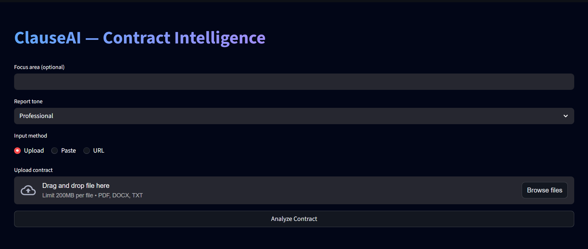
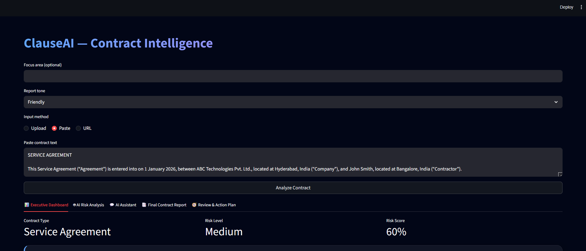
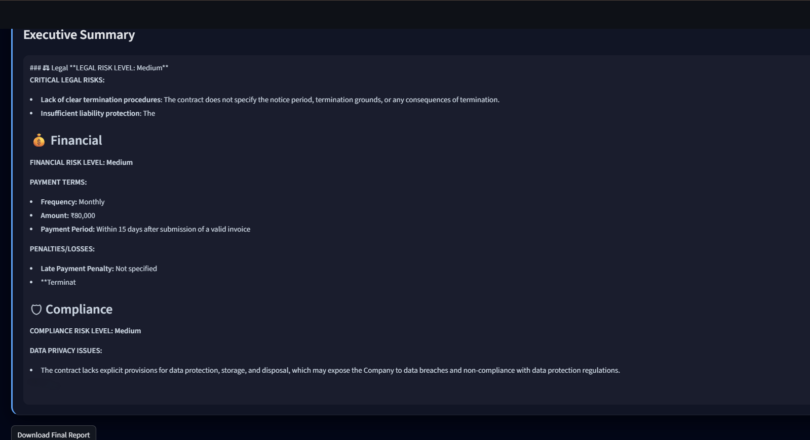
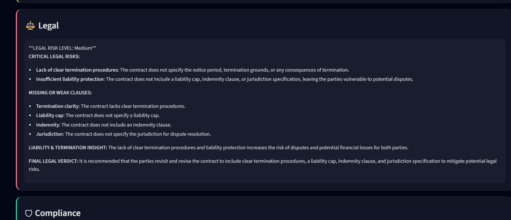
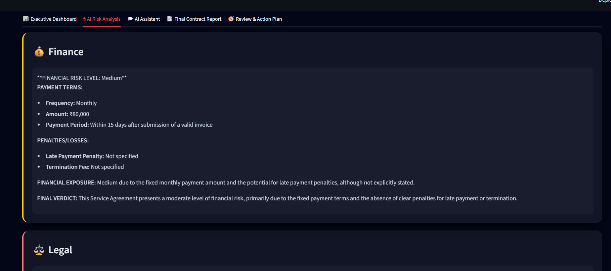
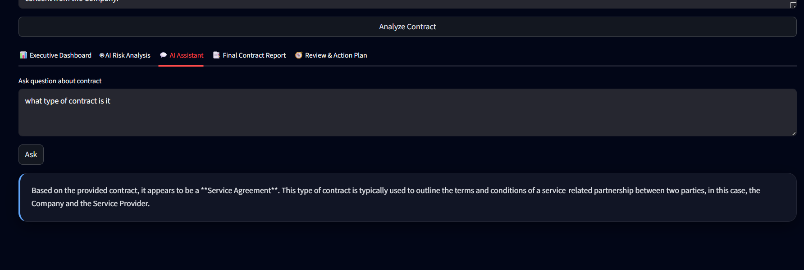
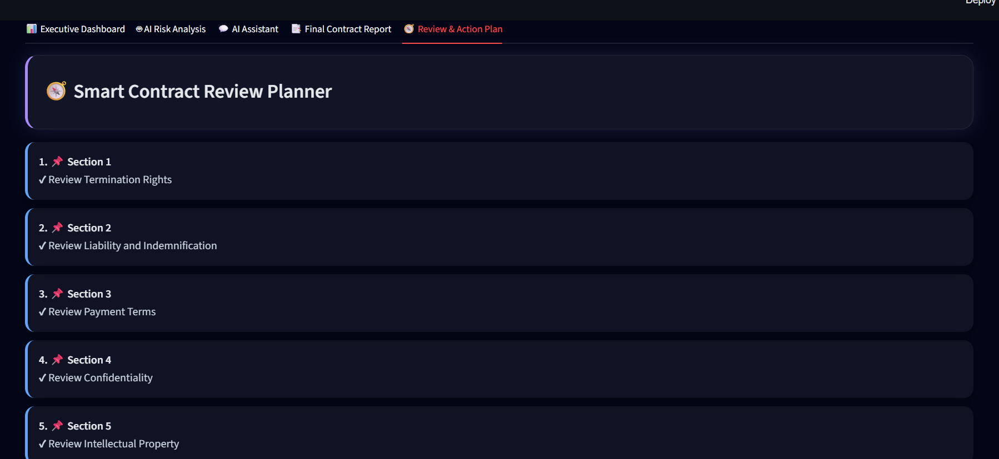

# ⚖️ ClauseAI – AI Legal Contract Analyzer

ClauseAI is an AI-powered legal contract analysis system that helps users understand complex legal agreements by automatically extracting clauses, identifying risks, and generating summaries using Natural Language Processing (NLP) and machine learning techniques.

The system provides an interactive dashboard where users can upload contracts and receive structured insights about important legal clauses, compliance issues, and potential risks.

---

# 🚀 Features

- 📄 Automatic clause extraction from legal contracts
- ⚠️ Risk detection and compliance analysis
- 🧠 AI-powered contract summarization
- 🔍 Named Entity Recognition (NER) for legal entities
- 📊 Multi-agent contract analysis system
- 💻 Interactive Streamlit dashboard
- 📑 Automated final report generation

---

# 📷 Application Demo

### Homepage

.png)

### Analysis Results Output


### Contract Summary


### Agents Analysis Report

#### Legal Clause Analysis


#### Finance Clause Analysis


#### Compliance Check


### Query Interface


### Final Report
.png)
.png)

### Review Planner

.png)

---

# 🧠 How ClauseAI Works

1. The user uploads a legal contract through the Streamlit interface.
2. The system preprocesses the document using NLP techniques.
3. Named Entity Recognition identifies important legal entities.
4. Multiple AI agents analyze different aspects of the contract:
   - Legal clause extraction
   - Financial clause analysis
   - Compliance verification
5. The system generates summaries and identifies potential risks.
6. A structured final report is generated and displayed in the dashboard.

---

# 🧠 System Architecture

ClauseAI uses a **multi-agent pipeline architecture**.

The contract passes through several stages:

```text
Contract
   ↓
Text Loader
   ↓
Chunker
   ↓
Classifier
   ↓
Agents
   ↓
Risk Analyzer
   ↓
Report Generator

Agents specialize in different analysis tasks.

The main agents include:

Legal Agent

Finance Agent

Compliance Agent

Operations Agent

Summary Agent

🛠 Tech Stack
Programming Language

Python

Libraries & Frameworks

spaCy (Natural Language Processing)

Streamlit (Web Interface)

Pandas

NumPy

Tools

Git

GitHub

📂 Project Structure
ClauseAI
│
├── agents
│   ├── clause_analyzer.py
│   ├── contract_classifier.py
│   ├── executor_agent.py
│   ├── report_generator.py
│   └── review_planner.py
│
├── agents_llm
│   ├── classifier_agent.py
│   ├── compliance_agent.py
│   ├── finance_agent.py
│   ├── legal_agent.py
│   ├── operations_agent.py
│   └── summary_agent.py
│
├── memory
│   ├── memory.py
│   └── pinecone_memory.py
│
├── report
│   ├── final_report.py
│   └── final_report_utils.py
│
├── utils
│   ├── ai_flow_explainer.py
│   ├── chunker.py
│   ├── duplicate_checker.py
│   ├── file_loader.py
│   ├── history_manager.py
│   ├── hybrid_llm.py
│   ├── local_llm.py
│   ├── ollama_engine.py
│   ├── parallel_runner.py
│   ├── pdf_loader.py
│   ├── risk_formatter.py
│   ├── risk_graph.py
│   ├── risk_heuristic.py
│   ├── risk_score.py
│   ├── text_loader.py
│   └── token_guard.py
│
├── vectorstore
│   └── pinecone_client.py
│
├── scripts
│   ├── check_env.py
│   └── check_key.py
│
├── tests
│   ├── test_chunking.py
│   ├── test_classifier.py
│   ├── test_clause_analyzer.py
│   ├── test_compliance.py
│   ├── test_executor.py
│   ├── test_full_pipeline.py
│   ├── test_grok.py
│   ├── test_pinecone.py
│   ├── test_report.py
│   └── test_review_planner.py
│
├── Demo
│   └── (project screenshots)
│
├── streamlit_app.py
├── contract_history.json
├── LICENSE
└── README.md

▶️ Installation
Clone the repository

git clone https://github.com/adithyavaddadi/ClauseAI.git
cd ClauseAI
I
nstall dependencies
pip install -r requirements.txt

Run the application
streamlit run streamlit_app.py

Open in browser
http://localhost:8501

🧪 Running Tests
pytest tests/


🚧 Development Status

ClauseAI is currently under active development.

The core AI pipeline and multi-agent contract analysis system are implemented. Current development is focused on improving the user interface and enhancing the user experience.

Current Work:

Improving Streamlit dashboard layout

Enhancing visualization of clause analysis results

Better display of risk scores and compliance insights

Adding interactive contract query features

Improving report visualization

Planned UI Improvements

Better dashboard layout and navigation

Visual risk indicators and graphs

Contract clause highlighting

Interactive analysis panels

Improved report download interface

🎯 Project Objective

Legal contracts are complex and require careful review. ClauseAI aims to simplify contract understanding by using AI agents that analyze documents, detect risks, and generate structured insights.

This system demonstrates how multi-agent AI architectures can assist legal and compliance workflows.

🔮 Future Improvements

LLM-based clause reasoning

Contract comparison system

Knowledge graph for contracts

Cloud deployment

Real-time collaborative review

👨‍💻 Author

Adithya Vaddadi
B.Tech – Artificial Intelligence & Machine Learning

GitHub
https://github.com/adithyavaddadi

LinkedIn
https://linkedin.com/in/adithya-vaddadi-536176330