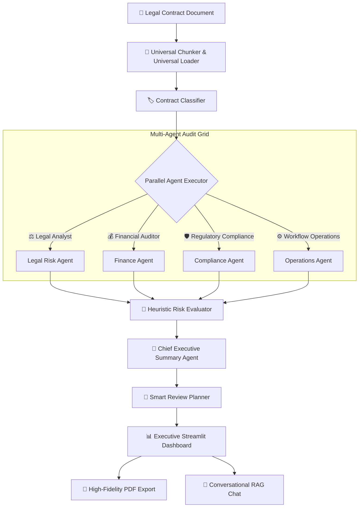

# ⚖️ ClauseAI – AI Legal Contract Analyzer

[](https://python.org)
[](https://streamlit.io)
[]()
[](https://pinecone.io)
[]()

ClauseAI is an **enterprise-grade multi-agent RAG system** designed to revolutionize contract analysis and intelligence. Powered by custom LLM-based agents, parallel executors, heuristic checks, and advanced NLP parsers, ClauseAI converts dense and obscure legal agreements into clean, structured, and actionable dashboards.

---

## 🚀 Key Features

*   **⚡ Parallel Multi-Agent Intelligence**: Runs specialized analysis agents (**Legal**, **Finance**, **Compliance**, **Operations**, and **Executive Summary**) in parallel via a thread-safe executor.
*   **🧠 Hybrid Cloud/Local LLM Routing**: Leverages high-performance cloud inference (**Groq / Llama-3.1**) with seamless fallback to secure local offline execution (**Ollama / Phi-3 / Llama-3.2**).
*   **🧭 Smart Contract Review Planner**: Autogenerates a strategic checklist, focus questions, estimated review times, and assigns risk levels for legal auditors.
*   **🛡️ Multi-Tier Heuristic Risk Engine**: Computes precise risk ratings (0–100%) by correlating keyword densities, negation states, and structural anomalies.
*   **📑 Premium Automated PDF Exporter**: Builds and delivers high-fidelity, client-ready contract intelligence PDF summaries directly from the dashboard.
*   **💬 Interactive Conversational RAG**: Allows auditors to grill their contracts interactively with questions via an integrated hybrid LLM chat assistant.

---

## 🧠 System Architecture

ClauseAI orchestrates specialized analytical layers concurrently to provide thorough, multi-dimensional auditing. Below is the intelligence routing and decision flow:



---

## 📁 Repository Structure

The modular workspace separation guarantees complete encapsulation:

```text
ClauseAI/
│
├── agents/                       # Orchestration and Parsing Agents
│   ├── clause_analyzer.py        # Individual clause segment risk parsing
│   ├── contract_classifier.py    # Multi-class agreement type categorizer
│   ├── executor_agent.py         # Concurrently boots and monitors agents
│   ├── report_generator.py       # Aggregates structured responses
│   └── review_planner.py         # Autogenerates audit questions and timings
│
├── agents_llm/                   # LLM Prompt Engineering & Core Prompts
│   ├── classifier_agent.py       # Cloud-based semantic contract categorizer
│   ├── compliance_agent.py       # Regulatory, GDPR, and data protection agent
│   ├── finance_agent.py          # Liquidated damages, payment schedules agent
│   ├── legal_agent.py            # Liability cap, jurisdiction, and indemnity agent
│   ├── operations_agent.py       # SLA, timelines, and execution risk agent
│   └── summary_agent.py          # Formulates the master executive summary
│
├── memory/                       # Historical State Management
│   ├── memory.py                 # Thread-safe in-memory session manager
│   └── pinecone_memory.py        # Semantic Pinecone vector store memory
│
├── report/                       # Document Generation Assets
│   ├── final_report.py           # Primary report rendering pipelines
│   └── final_report_utils.py     # Regex and text-cleansing helpers
│
├── utils/                        # System Engineering Utilities
│   ├── ai_flow_explainer.py      # CSS-animated dashboard reasoning logs
│   ├── chunker.py                # Paragraph and sentence sliding parser
│   ├── file_loader.py            # Universal loader for PDF, DOCX, TXT, and Web URLs
│   ├── history_manager.py        # Local contract tracking database
│   ├── hybrid_llm.py             # Groq API and local Ollama routing controller
│   ├── local_llm.py              # Ollama API client engine
│   ├── ollama_engine.py          # Optional thread-safe offline controller
│   ├── pdf_loader.py             # PyPDF2 and pdfplumber extraction adapter
│   ├── risk_score.py             # Heuristic formula and keyword scoring
│   ├── risk_heuristic.py         # Advanced multi-tier risk analyzer
│   └── token_guard.py            # Token counter and automatic prompt trimmer
│
├── vectorstore/                  # Long-term semantic indexing
│   └── pinecone_client.py        # Pinecone RAG database vector adapter
│
├── scripts/                      # Admin & Diagnostic Scripts
│   ├── check_env.py              # Performs full verification check
│   └── check_key.py              # Masked config key test suite
│
├── tests/                        # Full Pytest Suite (11+ unit tests)
│   ├── test_chunking.py          # Sentence-sliding validations
│   ├── test_full_pipeline.py     # End-to-end multi-agent system test
│   └── test_review_planner.py    # Verification planner validation
│
├── streamlit_app.py              # Interactive Front-end Web Dashboard
├── requirements.txt              # Standard system dependency specifications
└── LICENSE                       # MIT License
```

---

## 🛠️ Tech Stack & Dependencies

ClauseAI is built using high-performance libraries to maintain minimal resource utilization while offering maximal output accuracy:

*   **Web Dashboard**: Streamlit (Advanced dark premium layout, custom HSL styling, and dynamic CSS animations)
*   **Orchestration & Parallelism**: LangGraph & Concurrent ThreadPoolExecutor
*   **Natural Language Processing**: spaCy (Semantic clause boundaries & NER models)
*   **Document Loading**: PyPDF2, pdfplumber, python-docx, and BeautifulSoup4
*   **Report Generation**: ReportLab (High-fidelity, customized canvas PDF building)
*   **Inference & RAG Storage**: Groq Cloud SDK, Ollama Local API, and Pinecone Vector Client

---

## 📦 Setup & Installation Instructions

Follow this seamless workflow to set up and initiate ClauseAI locally:

### 1. Pre-requisites
*   **Python**: Version `3.10` or higher.
*   **Ollama (Optional for offline execution)**: Download and launch from [ollama.com](https://ollama.com). Pull models via terminal:
    ```bash
    ollama pull phi3:mini
    ```

### 2. Install Project Dependencies
Clone the repository and install the locked versions from the `requirements.txt`:
```bash
# Clone the repository
git clone https://github.com/adithyavaddadi/Clause-Ai.git
cd Clause-Ai

# Create virtual environment
python -m venv .venv
.venv\Scripts\activate  # On macOS/Linux: source .venv/bin/activate

# Install requirements
pip install -r requirements.txt
```

### 3. Setup Configuration `.env`
Create a `.env` file in the root workspace directory with the following variables:
```env
# Cloud API Keys
GROQ_API_KEY=your_gsk_api_key_here
GROQ_MODEL=llama-3.1-8b-instant

# Vector memory (Optional)
PINECONE_API_KEY=your_pinecone_api_key_here

# Local Offline Execution (Optional Fallback)
OLLAMA_URL=http://127.0.0.1:11434/api/generate
OLLAMA_MODEL=phi3:mini
```

---

## 🧪 Verification & Execution

### 1. Perform a Diagnostics Verification
Ensure the environment, directories, and keys are properly mapped before launching:
```bash
python scripts/check_env.py
```

### 2. Launch the Streamlit Web Application
Spin up the highly premium Dark-themed contract analyzer UI:
```bash
streamlit run streamlit_app.py
```
Open [http://localhost:8501](http://localhost:8501) in your browser.

### 3. Run the Automated Test Suite
To verify core logic, parser chunks, and LLM classifiers remain bug-free:
```bash
pytest tests/
```

---

## 👨‍💻 Author Info & Links

**Adithya Vaddadi**  
*B.Tech in Artificial Intelligence & Machine Learning*

*   **GitHub**: [@adithyavaddadi](https://github.com/adithyavaddadi)
*   **LinkedIn**: [Adithya Vaddadi Profile](https://linkedin.com/in/adithya-vaddadi-536176330)

---
*Developed with ❤️ as a Multi-Agent Legal Intelligence Framework.*